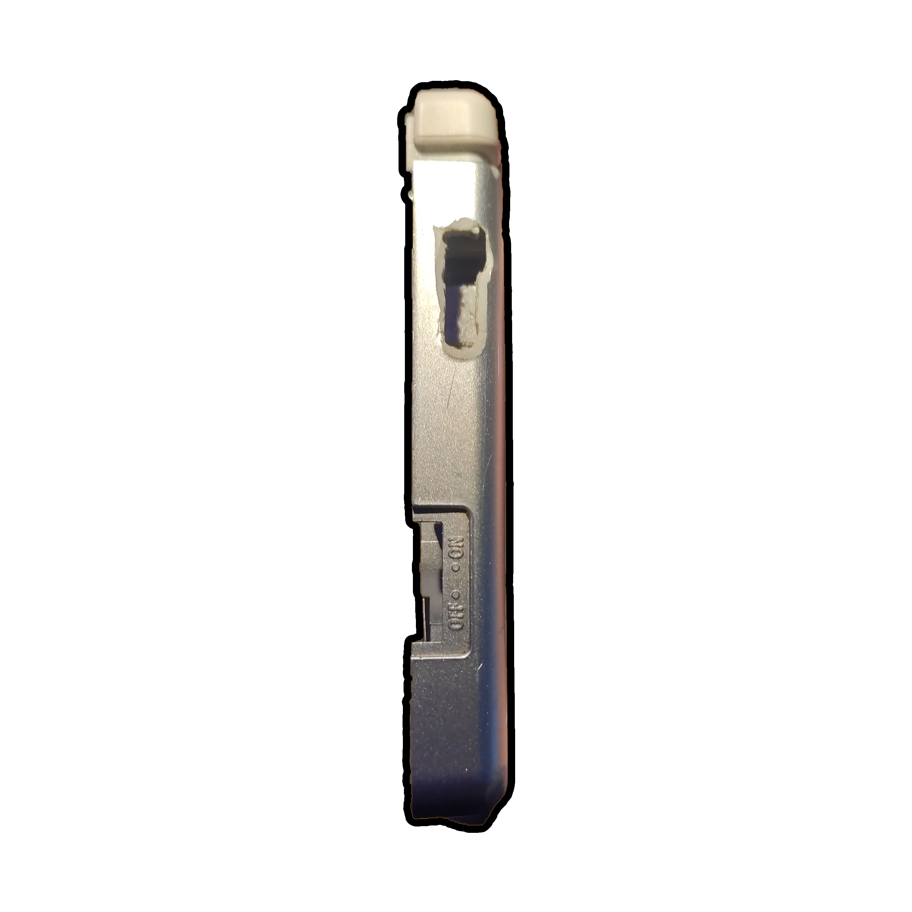
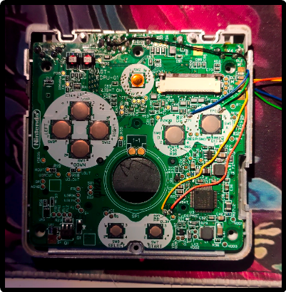
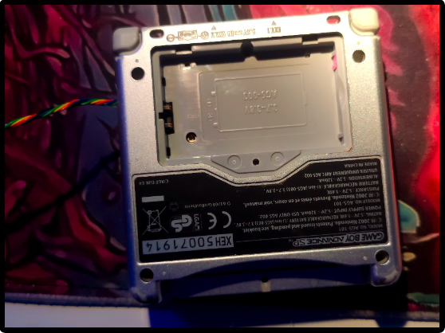
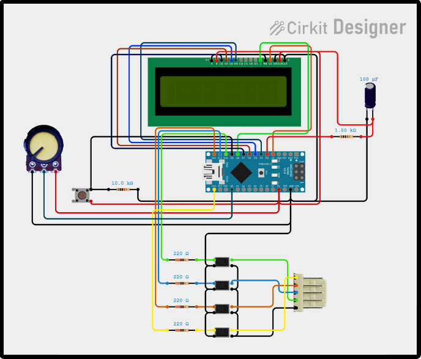
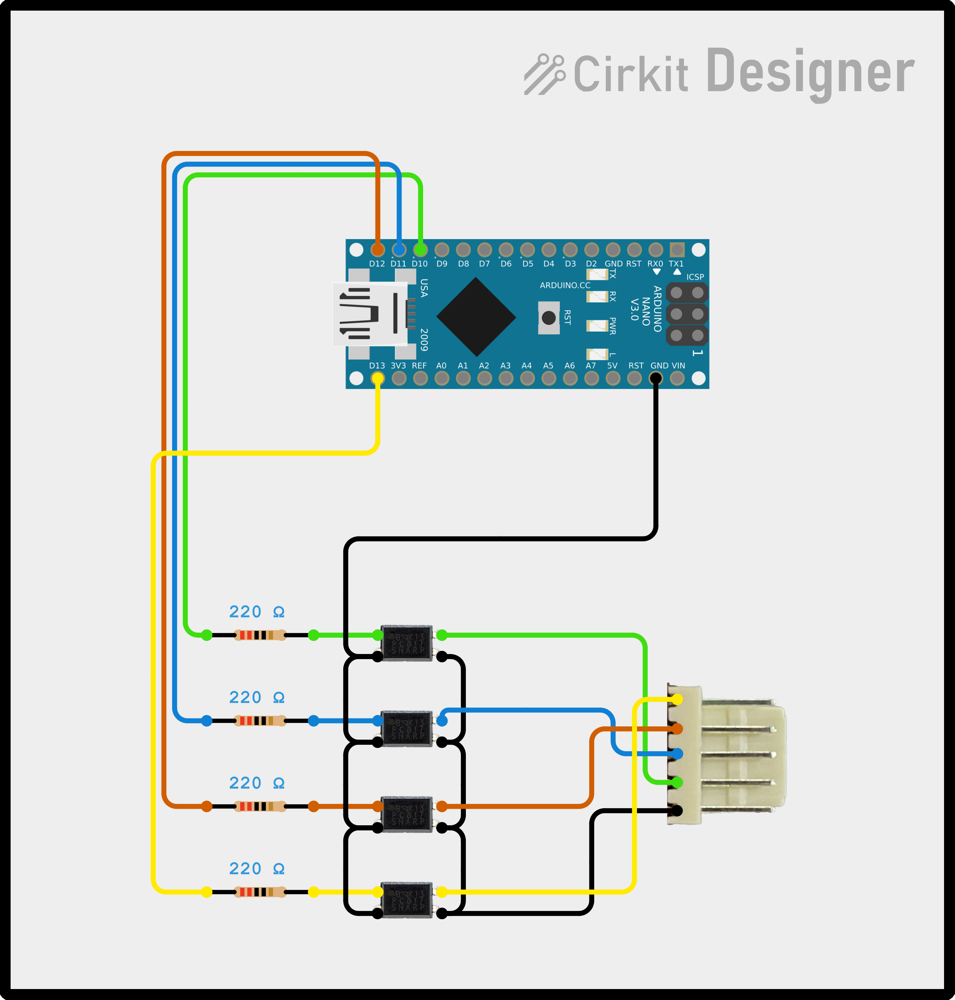
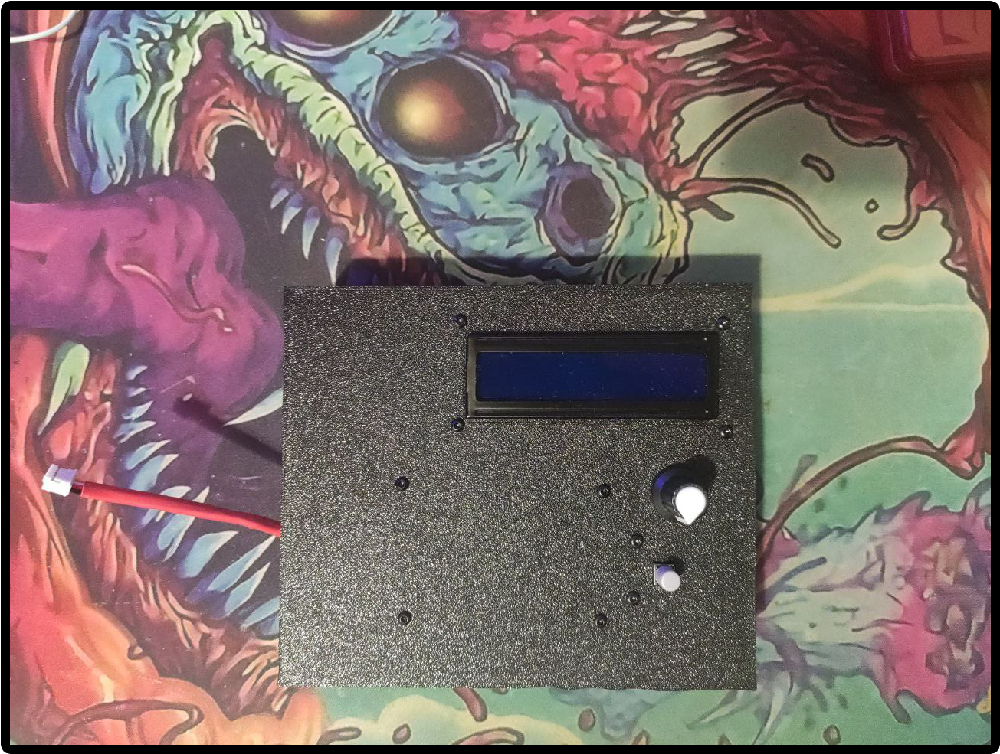

# Responsibility ⚠️
This guide is provided for informational purposes and has been compiled with the utmost care. However, the author accepts no responsibility for any damages, malfunctions, or failures arising from the use of the information contained herein. Users are advised to proceed with caution and use their judgment and expertise. Using this guide is entirely at your own risk.

Following this guide will irreversibly modify the shell.

# System Usage Guide 📝
* Power the system through the USB-C port.
* Connect the system connector to the one installed on the GBA.
* Turn on the system.

## If using the version with LCD display 🖥️
* Adjust brightness by clicking the button.
* Once you’ve selected the desired brightness, hold the button down for more than 2 seconds and then release it.
* Use the potentiometer to set the timer. The potentiometer can increase or decrease the timer by one, ten, one hundred, or one thousand units, depending on the direction of rotation.
* After setting the timer, click the button.
* The GBA will automatically restart after 5 seconds.
* When the set time is up, Arduino will press the A button on the GBA.
* Reset the system by powering off and on Arduino.

## If using the version without LCD display 👀
This version requires a PC.
* Open the `NoDisplayMaxOptimized.ino` code with Arduino IDE.
* In line 2, change the `value` field to set the desired time for the timer.
* Connect Arduino to the GBA via the connector.
* Connect Arduino to the PC.
* If off, turn Arduino on via the button.
* Upload the code to Arduino.
* Arduino will automatically restart the GBA after 5 seconds.
* When the time set in `value` expires, Arduino will press the A button.
* Reset the system by powering off and on Arduino.

## Differences Between the three Code Versions 🆚
Three code versions are available:
* `CompleteCode.ino`: Includes all features, such as the LCD panel and real-time timer progress updates.
* `OptimizedCode.ino`: Includes the LCD panel but is optimized to reduce timer lag by dedicating all resources to timer control, without calculating progress percentage.
* `NoDisplay.ino`: Excludes the LCD display, potentiometer, and button, requiring a PC for use.

`OptimizedCode.ino` and `NoDisplay.ino` provide the same performance.
In `CompleteCode.ino`, performance is still considered, as the remaining percentage is updated only once every 5 seconds, and only if there are at least 10 seconds left, allowing for the best possible precision.

## Considerations about the code
The system must be restarted every time after the timer because I've used the `micros` function that overflow after around 70 minutes. To avoid problems I choos this approach

# Details 🔎
This document does NOT cover RNG manipulation techniques on GBA but presents a system to automate the RNG manipulation process on GBA.  
The goal is to create a system usable without a PC. Refer to the accompanying video for additional step-by-step details.

# Modifying the GBA 🛠️
In this example, a Game Boy Advance SP is used.

## Step One 1️⃣
Solder thin wires onto the pins highlighted in the image. (Video for details)

## Step Two 2️⃣
Drill the shell.
You can use a pre-modified shell with a hole on the right side.

The goal is to guide the newly soldered wires out of the shell. Choose the best spot according to your needs. (Video for details)

## Step Three 3️⃣
Reassemble the GBA SP. (Video for details)

# Building the Circuit ⚡
Follow the wiring diagram to create the circuit. (Video for details)

A USB-C extension with a button is recommended to interrupt power, allowing Arduino to be powered and reprogrammed even after assembly. (Video for details)
Many portable batteries stop charging if the load is too low, so a resistor in parallel to Arduino is added to enable power from portable batteries. There are more efficient solutions, but this is the simplest and most practical. (Video for details)

## Circuit without LCD Display, Potentiometer, and Button ⚡👀
Use the `NoDisplay.ino` code with this wiring diagram.

# Printing and Assembling the Enclosure 📐
This was my first experience designing and printing an enclosure for a circuit, and there is certainly room for more compactness and optimization.
[This enclosure](../../3dFiles/) is designed for the complete version of the circuit.
Print the 3D file, choose points for drilling holes for the button, input USB-C port, and GBA connector.
Assemble the circuit in the enclosure. (Video for details)

There is a section under the cover where a portable battery can be placed. This choice allows the system to be used without a PC or electrical outlet.

# System Testing 🔬
A system test is available here.

# Physical Error Evaluation 📊
After multiple tests, the maximum number of attempts to calculate physical error in delay was found to be 4. In most cases, no more than 3 attempts were needed.
This error arises from the way Arduino measures time: its ceramic chip is sensitive to temperature changes, causing slight precision fluctuations.
A possible solution could be the use of dedicated timer modules, less affected by temperature.
Also, consider the possible delay of optocouplers and connections.

# Issues 🆘
No issues encountered so far.

# License 🛂
This project is licensed under the **GNU General Public License v3.0**. You are free to use, modify, and distribute this code under the following conditions:

1. **Attribution**: If you use this code as a basis for your project or create derivative works, please credit me by including my name (Ivan De Cosmis) in the project documentation, README, or other relevant materials.

2. **Share Alike**: Any derivative works based on this project must be licensed under GPLv3, ensuring future users benefit from your modifications.

3. **Commercial Use**: If you intend to use this project or derivatives for commercial purposes, contact me to discuss proper attribution and any agreements.

For more details, see the full text of the **GNU General Public License v3.0** [here](https://www.gnu.org/licenses/gpl-3.0.html).