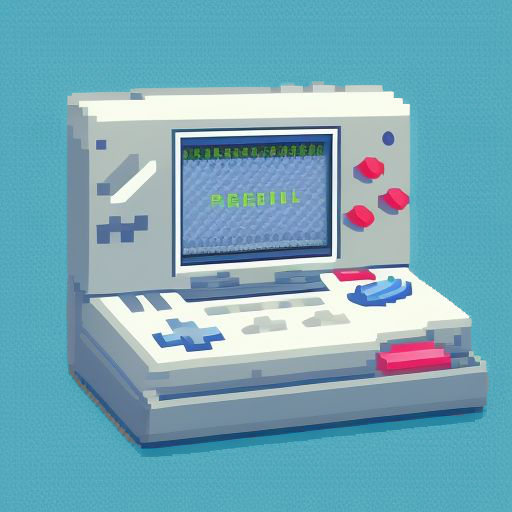

# GBAFrameSyncer

    

# Introduction 🎮⏳
This project aims to automate the RNG manipulation process, commonly used on consoles like the Game Boy Advance. This technique, for instance, is used to [obtain shiny Pokémon in games like Pokémon Emerald](https://www.youtube.com/watch?v=pciQkasUJ7g).

Currently, the main issue with this method is that the user must manually press the console buttons to try to reach the desired frame. This process can become lengthy and frustrating, especially when aiming for advanced frames that require long waiting times; if the correct frame isn’t reached, all the waiting time is lost.

With the proposed system, we will physically modify the console to allow Arduino to automatically manage the inputs on the Game Boy Advance, precisely selecting the desired frame based on a preset timer.

# Introduzione 🎮⏳
Questo progetto è volto ad automatizzare il processo di manipolazione dell’RNG, comunemente utilizzato su console come il Game Boy Advance. Questa tecnica, ad esempio, viene sfruttata per [ottenere Pokémon shiny in giochi come Pokémon Smeraldo](https://www.youtube.com/watch?v=pciQkasUJ7g).

Attualmente, il problema principale di questo metodo è che l'utente deve premere manualmente i pulsanti sulla console per cercare di raggiungere il frame desiderato. Questo processo può diventare lungo e frustrante, specialmente quando si punta a frame avanzati che richiedono attese prolungate; se poi non si riesce a selezionare il frame corretto, tutto il tempo trascorso in attesa viene perso.

Con il sistema proposto, modificheremo fisicamente la console per consentire ad Arduino di gestire automaticamente gli input sul Game Boy Advance, selezionando con precisione il frame desiderato in base a un timer preimpostato.

- [English version](guide/en/README.md)
- [Versione italiana](guide/it/README.md)